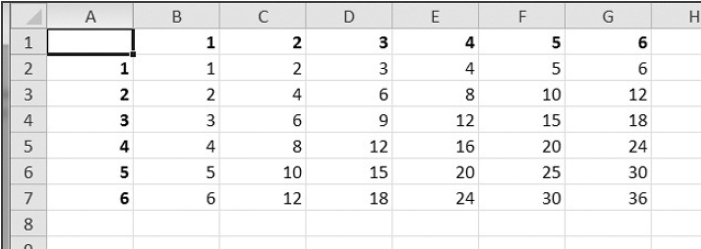
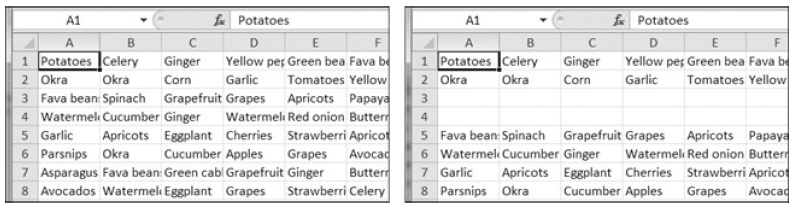
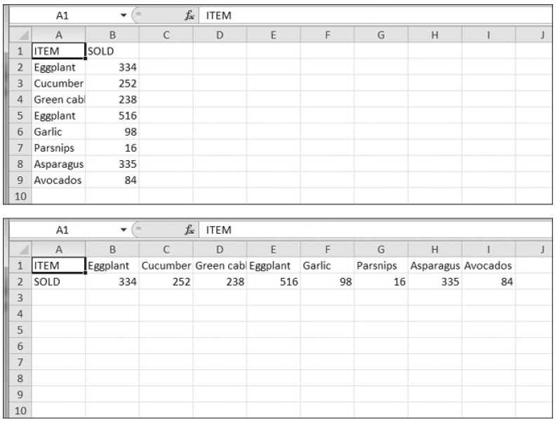

# Practice Projects #

For practice, write programs that perform the following tasks.

## Multiplication Table Maker ##

Create a program _multiplicationTable.py_ that takes a number _N_ from the command line
and creates an _N×N_ multiplication table in an Excel spreadsheet. For example, when the
program is run like this:

```bash
py multiplicationTable.py 6
```

`...` it should create a spreadsheet that looks like Figure 12-11.


_Figure 12-11. A multiplication table generated in a spreadsheet_

Row 1 and column A should be used for labels and should be in bold.

## Blank Row Inserter ##

Create a program `blankRowInserter.py` that takes two integers and a filename string as command line arguments. Let's call the first integer N and the second integer M. Starting at row N, the program should insert M blank rows into the spreadsheet. For example, when the program is run like this:

```bash
python blankRowInserter.py 3 2 myProduce.xlsx
```
`...` the “before” and “after” spreadsheets should look like Figure 12-12.



_Figure 12-12. Before (left) and after (right) the two blank rows are inserted at row 3_

You can write this program by reading in the contents of the spreadsheet. Then, when writing out the new spreadsheet, use a `for` loop to copy the first _N_ lines. For the remaining lines, add _M_ to the row number in the output spreadsheet.

## Spreadsheet Cell Inverter ##

Write a program to invert the row and column of the cells in the spreadsheet. For example, the value at row 5, column 3 will be at row 3, column 5 (and vice versa). This should be done for all cells in the spreadsheet. For example, the “before” and “after” spreadsheets would look something like Figure 12-13.



_Figure 12-13. The spreadsheet before (top) and after (bottom) inversion_

You can write this program by using nested `for` loops to read in the spreadsheet's data into a list of lists data structure. This data structure could have `sheetData[x][y]` for the cell at column `x` and row `y`. Then, when writing out the new spreadsheet, use `sheetData[y][x]` for the cell at column `x` and row `y`.

## Text Files to Spreadsheet ##

Write a program to read in the contents of several text files (you can make the text files yourself) and insert those contents into a spreadsheet, with one line of text per row. The lines of the first text file will be in the cells of column A, the lines of the second text file will be in the cells of column B, and so on.

Use the `readlines()` `File` object method to return a list of strings, one string per line in the file. For the first file, output the first line to column 1, row 1. The second line should be written to column 1, row 2, and so on. The next file that is read with `readlines()` will be written to column 2, the next file to column 3, and so on.

## Spreadsheet to Text Files ##

Write a program that performs the tasks of the previous program in reverse order: The program should open a spreadsheet and write the cells of column A into one text file, the cells of column B into another text file, and so on.